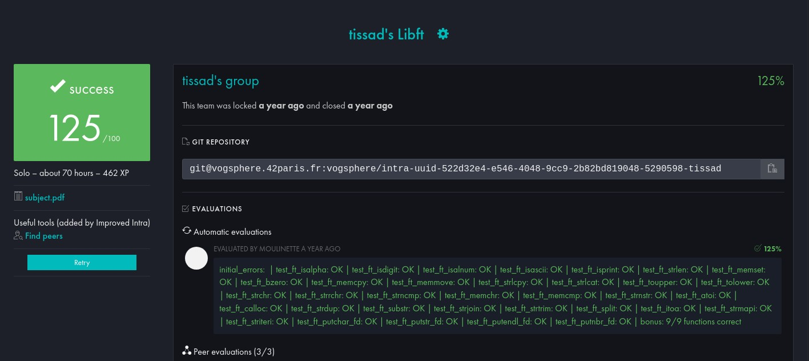

# 42cursus_libft
Libft 70H Pass with bonus Rigor, Algorithms & AI, Imperative programming November 30, 2023
<!-- add res.jpg hehe-->

### Targeted Skills
By completing this project, i acquire skills in C programming:

#### Fundamental Concepts
- Using pointers to manipulate dynamic structures.
- Creating and managing linked lists.
- Efficient memory management with `malloc` and `free`.
#### Rigor and Organization
- Organizing code across multiple files (.h and .c).
- Following conventions for readable and modular programs.
#### C Language Basics
- Structures `struct` to organize data.
- Conditions `if/else` and loops `for`, `while` to handle program logic.
